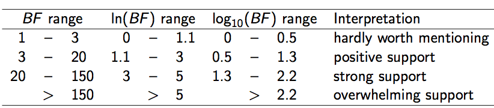
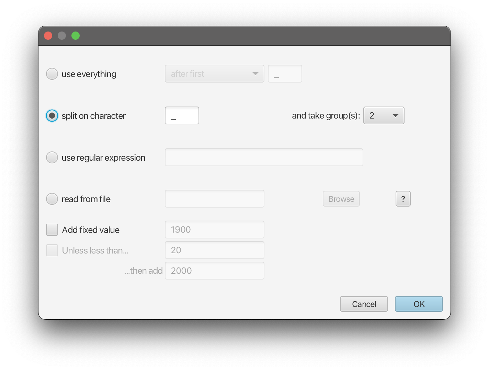
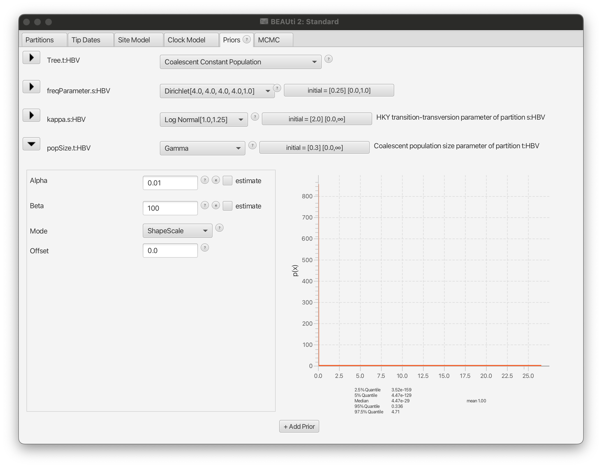
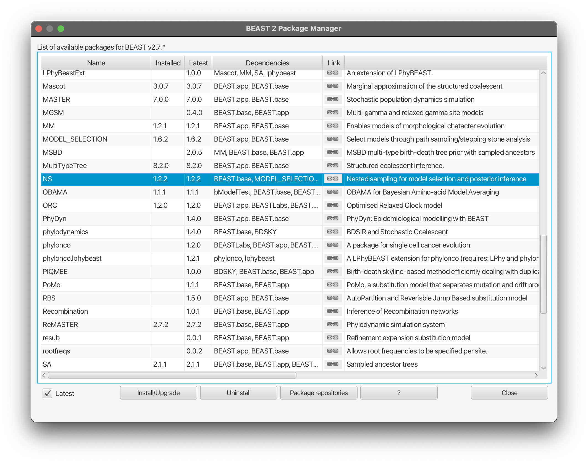
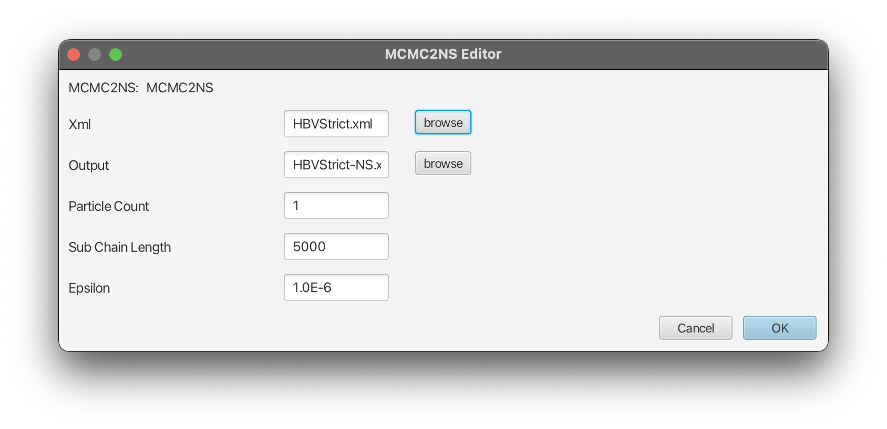

# Background

BEAST provides a bewildering number of models. Bayesians have two techniques to deal with this problem: model averaging and model selection. With **model averaging**, the MCMC algorithm jumps between different models, and models more appropriate for the data will be sampled more often than unsuitable models (see for example the [substitution model averaging tutorial](https://taming-the-beast.org/tutorials/Substitution-model-averaging/)). **Model selection** on the other hand just picks one model and uses only that model during the MCMC run. This tutorial gives some guidelines on how to select the model that is most appropriate for your analysis. 

Bayesian model selection is based on estimating the marginal likelihood: the term forming the denominator in Bayes' formula. This is generally a computationally intensive task and  there are several ways to estimate them. Here, we concentrate on nested sampling as a way to estimate the marginal likelihood as well as the uncertainty in that estimate.

Say, we have two models, $M_1$ and $M_2$, and estimates of their (log) marginal likelihoods, $Z_1$ and $Z_2$. We can calculate the Bayes' factor (BF), which is the fraction $BF = Z_1/Z_2$ (or the difference $\log(BF) = \log(Z_1) - \log(Z_2)$ in log space). Typically, if $\log(BF)$ is greater than 1, $M_1$ is favoured, otherwise $M_1$ and $M2$ are hardly distinguishable or $M_2$ is favoured. How much $M_1$ is favoured over $M_2$ can be found in the following table :

<figure>
	<a name="fig:bfs"></a>
	
	<figcaption>Figure 1: Bayes' factor support in favour of \(M_1\) against \(M_2\).</figcaption>
</figure>

Note that BFs are sometimes multiplied by a factor of 2, so beware of which definition was used when comparing BFs from different publications.


**Nested sampling** (NS) is an algorithm that works as follows:

* Randomly sample `N` points (also called particles) from the prior distribution
* While (marginal) likelihood estimates have not converged
	* Pick the point with the lowest likelihood $L_{min}$ and save it to the log file
	* Replace the point with a new one sampled from the prior via an MCMC chain of `subChainLength` steps, **under the condition that the new likelihood is at least $L_{min}$**

The main parameters of the NS algorithm are the number of particles (`N`) and the length of the MCMC chain to sample a replacement particle (`subChainLength`). To determine `N`, we first start the NS analysis with `N=1`. Based on the results of that analysis, we can determine a target standard deviation for marginal likelihood estimates and calculate the required `N` value using the estimated information measure `H` and a given formula (more details will follow later in the tutorail).

The `subChainLength` determines how independent the replacement point is from the $L_{min}$ point that was saved and is a parameter that needs to be determined by trial and error (see [FAQ](#nested-sampling-faq) for details).


----

# Programs used in this tutorial 

### BEAST2 - Bayesian Evolutionary Analysis Sampling Trees 2

BEAST2 is a free software package for Bayesian evolutionary analysis of molecular sequences using MCMC and strictly oriented toward inference using rooted, time-measured phylogenetic trees , . This tutorial uses the BEAST2 version 2.7.x.

### BEAUti2 - Bayesian Evolutionary Analysis Utility

BEAUti2 is a graphical user interface tool for generating BEAST2 XML configuration files.

Both BEAST2 and BEAUti2 are Java programs, which means that the exact same code runs on all platforms. For us it simply means that the interface will be the same on all platforms. The screenshots used in this tutorial are taken on a Mac OS X computer; however, both programs will have the same layout and functionality on both Windows and Linux. BEAUti2 is provided as a part of the BEAST2 package so you do not need to install it separately.

### Tracer

[Tracer](http://tree.bio.ed.ac.uk/software/tracer) is used to summarise the posterior estimates of the various parameters sampled by the Markov Chain. This program can be used for visual inspection and to assess convergence. It helps to quickly view median estimates and 95% highest posterior density intervals of the parameters, and calculates the effective sample sizes (ESS) of parameters. It can also be used to investigate potential parameter correlations. We will be using Tracer v1.7.2.

----

# Practical: Selecting a clock model

In this tutorial, we will analyse a dataset of hepatitis B virus (HBV) sequences sampled through time and concentrate on selecting a clock model. 
We will select between two popular clock models, the strict clock and the uncorrelated relaxed clock with log-normal-distributed rates (UCLN).

## Setting up the strict clock analysis

First thing to do is set up the two analyses in BEAUti, and run them in order to make sure there are differences in the analyses. The alignment can be downloaded [here](https://raw.githubusercontent.com/rbouckaert/NS-tutorial/master/data/HBV.nex). We will set up a model with tip dates, the HKY substitution model, the coalescent tree prior with constant population size, and a fixed clock rate. 

> __In BEAUti:__
> 
> * Start a new analysis using the `File > Template > Standard` template.
> * Import [HBV.nex](https://raw.githubusercontent.com/rbouckaert/NS-tutorial/master/data/HBV.nex) using `File > Import alignment`.
> * In the `Tip Dates` panel, select `Use tip dates`, click `Auto-configure`, select `split on character` and take group 2 (see [Fig 2](#fig:auto-config)).
> * In the `Site Model` panel, select `HKY` as the substitution model (`Subst Model`) and leave the rest as is.
> * In the `Clock Model` panel, set the `Mean clock rate` to `2E-5`. Usually we would want to estimate the clock rate, but to speed up the analysis for the tutorial we will fix the clock rate to `2E-5` as follows:
>     * Uncheck `Mode > Automatic set clock rate`. Now the `estimate` entry should not be grayed out anymore (see [Fig 3](#fig:uncheck-auto-set)).
>     * Uncheck the `estimate` box next to the clock rate entry.
> * In the `Priors` panel, select `Coalescent Constant Population` as the tree prior. Next, change the prior on the population size parameter `popSize` to a `Gamma` distribution with `alpha = 0.01` and `beta = 100` ([Fig 4](#fig:priors)).
> * In the `MCMC` panel, change the `Chain Length` to 1 million (`1E6`). You can also rename the output files for `tracelog` and `treelog` to include "Strict" to distinguish them from the relaxed clock analysis.
> * Save the file as `HBVStrict.xml`, and __do not close BEAUti just yet!__
> * Run the analysis with BEAST.

>
> __Note: Do you have a clock rate prior in the `Priors` panel?__ If so, the clock rate is being estimated, and you should revisit the `Clock Model` panel where the clock is set up!
>


<figure>
	<a name="fig:auto-config"></a>
	
	<figcaption>Figure 2: Configuring tip dates in BEAUti.</figcaption>
</figure>
<br>

<figure>
	<a name="fig:uncheck-auto-set"></a>
	
	<figcaption>Figure 3: Unchecking "Automatic set clock rate" in BEAUti.</figcaption>
</figure>
<br>

<figure>
	<a name="fig:priors"></a>
	
	<figcaption>Figure 4: Priors panel for strict clock analysis in BEAUti.</figcaption>
</figure>
<br>

## Setting up the relaxed clock analysis

> __While you are waiting for the strict clock analysis to finish, you can set up the relaxed clock analysis. This is now straightforward if BEAUti is still open (if BEAUti was closed, open BEAUti and load the file `HBVStrict.xml` by `File > Load`):__
> 
> * In the `Clock Model` panel, change `Strict clock` to `Relaxed Clock Log Normal`. Next, set the `Mean clock rate` to `2E-5`, and uncheck the `estimate` box.
> * In the `MCMC` panel, replace `Strict` in the file names for `tracelog` and `treelog` to `UCLN`.
> * Save the file as `HBVUCLN.xml`. __Note: Do not use `File > Save`; instead, use `File > Save as`, otherwise the strict clock XML file will be overwritten__.
> * Run the analysis in BEAST.

Once both analyses have completed, open the log files in Tracer and compare parameter estimates to see whether the two analyses differ substantially. You may also compare the trees in DensiTree.

> * Are there any parameters that are very different?
> * Do tree heights differ substantially? 
> * Which analysis is preferable and why? 
<!-- depends on the question you want to answer: if tree height is of interest, strict clock is preferred, since it reduces the uncertainty. If kappa is of interest, things are not that different -->

If there are no substantial differences between the analyses for the question you are interested in, you do not have to commit to one model or another, and you can claim that the results are robust under different models.

However, if there are significant differences, you may want to perform a formal test to see which model is preferred over other models (in other words, which model is a better fit to the given data). In a Bayesian context, in practice this comes down to estimating __marginal likelihoods__, and calculating __Bayes' factors__: the ratios of marginal likelihoods. Nested sampling  is one way to estimate marginal likelihoods. 

## Installing the NS package

To use nested sampling, we first have to install the NS (version {{ page.nsversion}}) package:

> __In BEAUti:__
> 
> * Open the Package Manager by `File > Manage Packages`.
> * Select NS and click `Install/Upgrade` ([Fig 5](#fig:install)).
> * **_Restart BEAUti_** to load the NS package.


<figure>
	<a id="fig:install"></a>
	
	<figcaption>Figure 5: Installing NS in the Package Manager window in BEAUti.</figcaption>
</figure>
<br>


## Setting up the nested sampling analyses

You can convert an MCMC analysis to an NS analysis using the `MCMC2NS` tool that comes with the NS package. 

> __In BEAUti:__
> 
> * Open the Package Application Launcher via the `File > Launch Apps` menu. 
> * In the dialog that pops up, select the `MCMC to NS converter (NS)` app and click `Launch`.
> * Select the XML file for the strict clock analysis (`HBVStrict.xml`), set the output file as `HBVStrict-NS.xml` in the same directory.
> * Change settings as shown in the [Figure 6](#fig:MCMC2NS) below.
> * Click `OK`, and `HBVStrict-NS.xml` should be created.
> * Repeat the steps above for the relaxed clock analysis (`HBVUCLN.xml`).


<figure>
	<a name="fig:MCMC2NS"></a>
	
	<figcaption>Figure 6: Converting an MCMC analysis to an NS analysis using the MCMC to NS converter</figcaption>
</figure>
<br>

Alternatively, you can do the MCMC-to-NS conversion in a text editor as follows:

> * Make a copy of the file `HBVStrict.xml`/`HBVUCLN.xml` as `HBVStric-NS.xml`/`HBVUCLN-NS.xml`.
> * Start a text editor and in both copied `*NS.xml` files, change
> 
> ```xml
> <run id="mcmc" spec="MCMC" chainLength="1000000">
> ```
> to
> ```xml
> <run id="mcmc" spec="nestedsampling.gss.NS" chainLength="1000000" particleCount="1" subChainLength="5000">
> ```
> 
> * Here the `particleCount` represents the number of active points (`N`) used in nested sampling: the more points used, the more accurate the marginal likelihood estimates, but the longer the analysis takes.
> * The `subChainLength` is the number of MCMC steps taken to get a new point that is independent (enough) from the point that was saved. Longer lengths mean longer runs, but also more independent samples. In practice, running with different `subChainLength` is necessary to find out which length is most suitable (see [FAQ](#nested-sampling-faq)).
> * Change the file names for the trace and tree log to include `NS` (searching for `fileName=` will get you there fastest).
> * Save the files, and run with BEAST.


Once the NS analyses have completed, you should see something like this at the end of the BEAST output for the strict clock NS analysis:

```
Total calculation time: 14.983 seconds
End likelihood: -198.17149973585296
Producing posterior samples

Marginal likelihood: -12428.65341414792 sqrt(H/N)=(10.596753616593245)=?=SD=(10.802109255318992) Information: 112.29118721078201
Max ESS: 17.082043893737673


Processing 228 trees from file.
Log file written to HBVStrict-HBV-NS.posterior.trees
Done!

Marginal likelihood: -12428.505410641856 sqrt(H/N)=(10.58988064783551)=?=SD=(10.328583134047442) Information: 112.14557213540105
Max ESS: 17.443137102014155


Log file written to HBVStrict-NS.posterior.log
Done!
```

and for the relaxed clock NS analysis:

```
Total calculation time: 17.254 seconds
End likelihood: -198.22029538745582
Producing posterior samples

Marginal likelihood: -12413.866266847353 sqrt(H/N)=(10.966419757539098)=?=SD=(11.100842819562212) Information: 120.2623622985439
Max ESS: 13.251755407507508


Processing 246 trees from file.
Log file written to HBVUCLN-HBV-NS.posterior.trees
Done!

Marginal likelihood: -12413.74471470421 sqrt(H/N)=(10.959292419373286)=?=SD=(11.010465189987908) Information: 120.10609033333276
Max ESS: 13.62674380195755


Log file written to HBVUCLN-NS.posterior.log
Done!
```

Nested sampling produces estimates of marginal likelihoods (ML) as well as their standard deviations (SDs). At first sight, the relaxed clock has a (log) ML estimate of about -12414, while the strict clock is much worse at about -12429. However, the standard deviation of both analyses is about 11, making these estimates indistinguishable. Since this is a stochastic process, the exact numbers for your run will differ, but should not be that far apart (typically less than 2 SDs or about 22 log points in 95% of the time).

To get more accurate ML estimates, the number of particles can be increased. In nested sampling, the SD is approximated by $\sqrt(\frac{H}{N})$, where $N$ is the number of particles and $H$ the measure of information. The latter is conveniently estimated and displayed in the NS analysis output (see above).

We can conveniently calculate the desired number of particles $N$ using the equation above. To aim for an SD of say 2, we need to run the NS analysis again with $N$ particles such that $\sqrt(\frac{H}{N}) = \sqrt(\frac{120}{N}) = 2$, hence $N = \frac{120}{2^2} = 30$ should be enough. (Note that I used $H = 120$ as estimated by the relaxed clock NS analysis instead of $H = 112$ by the strict clock to have some "safety margin".)

The computation time of nested sampling is linear with the number of particles, so it will take about 30 times longer to run if we change the `particleCount` from 1 to 30 in the XML:

> * Make a copy of the file `HBVStrict-NS.xml`/`HBVUCLN-NS.xml` as `HBVStric-NS30.xml`/`HBVUCLN-NS30.xml`.
> * Start a text editor and in both copied `*NS30.xml` files, change
> 
> ```xml
> <run id="mcmc" spec="nestedsampling.gss.NS" chainLength="1000000" particleCount="1" subChainLength="5000">
> ```
> to
> ```xml
> <run id="mcmc" spec="nestedsampling.gss.NS" chainLength="1000000" particleCount="30" subChainLength="5000">
> ```

To save time, this tutorial provides you pre-cooked NS runs with 30 particles: HBVStrict-NS30.log and HBVUCLN-NS30.log.

## Analyzing the nested sampling results

We will now download the pre-cooked log files [HBVStrict-NS30.log](https://raw.githubusercontent.com/rbouckaert/NS-tutorial/master/precooked_runs/HBVStrict-NS32.log) and [HBVUCLN-NS30.log](https://raw.githubusercontent.com/rbouckaert/NS-tutorial/master/precooked_runs/HBVUCLN-NS32.log) and analyze them using the `NSLogAnalyser` tool that comes with the package:

> __In BEAUti:__
> 
> * Open the Package Application Launcher via `File > Launch Apps`.
> * In the dialog,  select the `Nested Sampling Log Analyser (NS)` app and click `Launch`.
> * Select the log file for the strict clock analysis (`HBVStrict-NS30.log`), set the output file as `HBVStrict-NS30.out` in the same directory.
> * Change `N` (number of particles) to `30` as shown in the [Figure 6](#fig:MCMC2NS) below.
> * Click `OK`, and after some time the output should be directly printed out in the pop-up window.
> * Repeat the steps above for the relaxed clock analysis (`HBVUCLN-NS30.log`).


The output for the strict clock analysis should be something like this:

```
Loading HBVStrict-NS30.log, burnin 0%, skipping 0 log lines

|---------|---------|---------|---------|---------|---------|---------|---------|
*********************************************************************************

Marginal likelihood: -12425.109181191325 sqrt(H/N)=(1.9521472137472828)=?=SD=(1.9705746084339777) Information: 114.32636232423839
Max ESS: 428.12858160613445

Calculating statistics

|---------|---------|---------|---------|---------|---------|---------|---------|
********************************************************************************


Log file written to HBVStrict-NS30.out
#Particles = 30
item               mean     stddev   
posterior          -12507.9 3.496242
likelihood         -12310.7 3.503635
prior              -197.240 1.536168
treeLikelihood     -12310.7 3.503635
Tree.height        3462.917 122.9049
Tree.treeLength    20743.37 553.0787
kappa              2.708609 0.153543
freqParameter.1    0.242749 0.005936
freqParameter.2    0.265167 0.006415
freqParameter.3    0.217178 0.0046  
freqParameter.4    0.274905 0.005577
popSize            2351.248 299.4825
CoalescentConstant -163.311 3.099342
Done!
```

This gives us an ML estimate of -12425.1 with an SD of 1.97 for the strict clock model, slightly better than the SD of 2 we aimed for. 

<!-- Furthermore, there are posterior estimates of all the entries in the trace log. Nested sampling does not only estimate MLs and SDs, but can also provide a sample from the posterior, which can be useful for cases where MCMC has trouble with convergence. But let's not digress too much and get back to model selection. -->

For the relaxed clock analysis, we get:

```
Marginal likelihood: -12445.664084956716 sqrt(H/N)=(2.24153635221014)=?=SD=(2.152335911216865) Information: 150.73455654838628
```
This gives us an ML of -12445.7 with an SD of 2.24 for the uncorrelated LogNormal relaxed clock model. 

Therefore, the log BF is -12417.4 - -12426.2 = 8.8, which is more than twice the sum of the SDs, so can be considered reliable evidence in favour of the relaxed clock model. 

Note that judging from the table at the start of the tutorial, this amounts to overwhelming support for the relaxed clock.


<!--
## Setting up the geographic model with strict and relaxed clock

* Install the GEO_SPHERE package.
* Go to the data partitions tab, and click the '+' button at the bottom of the screen.
A dialog pops up where you can select what you want to add. Choose `Add Spherical Geography` and click `OK`.
* A new window pops up where you can choose the tree where you want to add geography.
Also, you can change the trait name to `geo`;
* When you click OK, a dialog is shown where you can enter latitude and longitude for each taxon. In this tutorial, this information is encoded in the taxon name, so we can guess it from the name. 
	* Click `Guess latitude`, and a dialog is shown. Choose `split on character` and take group 3 for the latitude. When you click OK, the latitude field of the table is populated.
	* Click `Guess longitude`, and again a dialog is shown. Choose `split on character` and take group 4 for the longitude.
	When you click OK, the table is completely populated. 
* Now, the longitudes and latitudes are properly populated. Click close, and a second data partition is created.
* The clock model now looks like this:
* For the geography, we select a strict clock for the first analysis (save as `HBVgeoStrict.xml`) and a relaxed clock with log-normal distribution for the second analysis) save as `HBVgeoUCLN.xml`). 
* As before, copy the files to a name including NS and in a text editor change
```xml
<run id="mcmc" spec="MCMC" chainLength="1000000">
```
to
```xml
<run id="mcmc" spec="beast.gss.NS" chainLength="20000" particleCount="1" subChainLength="5000">
```
* Save both files, and run with BEAST.
-->


# Nested sampling FAQ
<a name="nested-sampling-faq">  </a>

## The analysis prints out multiple ML estimates with their SDs. Which one should I choose?

The difference between the estimates is the way they are estimated from the nested sampling run. Since these are estimates that require random sampling, they differ from one estimate to another. When the standard deviation is small, the estimates will be very close, but when the standard deviations is quite large, the ML estimates can substantially differ. Regardless, any of the reported estimates are valid estimates, but make sure to report them with their standard deviation.


## How do I know the sub-chain length is large enough?

NS works in theory if and only if the points generated at each iteration are independent. If you already did an MCMC run and know the effective sample size (ESS) for each parameter, to be sure every parameter in every sample is independent you can take the length of the MCMC run divided by the smallest ESS as sub-chain length. This tend to result in quite large sub-chain lengths.

In practice, we can get away much smaller sub-chain lengths, which you can verify by running multiple NS analysis with increasing sub-chain lengths. If the ML and SD estimates do not substantially differ, you know the shorter sub-chain length was sufficient.


## How many particles do I need?

To start, use only a few particles. This should give you a sense of the information `H`, which is one of the estimates provided by the NS analysis. If you want to compare two hypotheses, you want the difference between `ML1` and `ML2` to be at least `2*sqrt(SD1*SD1+SD2*SD2)` in order to make sure the difference is not due to randomisation.

If the difference is larger, you do not need more particles.

If the difference is smaller, you can guess how much the SD estimates must shrink to get a difference that is sufficiently large. Since the `SD=sqrt(H/N)`, we have that `N=H/(SD*SD)` and `H` comes from the NS run with a few particles. Run the analysis again, with the increased number of particles, and see if the difference becomes large enough.

If the difference is less than 2, the hypotheses may not be distinguishable -- in terms of Bayes factors, are barely worth mentioning.


## Is NS faster than path sampling/stepping stone (PS/SS)?

This depends on many things, but in general, depends on how accurate the estimates should be. For NS, we get an estimate of the SD, which is not available for PS/SS. If the hypotheses have very large differences in MLs, NS requires very few (maybe just 1) particle, and will be very fast. If differences are smaller, more particles may be required, and the run-time of NS is linear in the number of particles.

The parallel implementation makes it possible to run many particles in parallel, giving a many-particle estimate in the same time as a single particle estimate (PS/SS can be parallelised by steps as well).

## The output is written on screen, which I forgot to save. Can I estimate them directly from the log files?

The NS package has a `NSLogAnalyser` application that you can run via the menu `File/Launch apps` in BEAUti -- a window pops up where you select the `NSLogAnalyser`, and a dialog shows you various options to fill in. You can also run it from the command line on OS X or Linux using

```
/path/to/beast/bin/applauncher NSLogAnalyser -N 1 -log  xyz.log
```

where the argument after `N` is the `particleCount` you specified in the XML, and `xyz.log` the trace log produced by the NS run.


## Why are some NS runs longer than others?

Nested sampling stops automatically when the accuracy in the ML estimate cannot be improved upon. Because it is a stochastic process, some analyses get there faster than others, resulting in different run times.


## Why are the ESSs so low when I open a log file in Tracer?

An NS analysis produces two trace log files: one for the nested sampling run (say `myFile.log`) and one with the posterior sample (`myFile.posterior.log`).

The ESSs in Tracer of log files with the posterior samples are meaningless, because the log file is ordered using the nested sampling run. If you look at the trace of the Likelihood, it should show a continuous increasing function. It is not quite clear how to estimate ESSs of a nested sampling run yet, though the number of entries in the posterior log is equal to the maximum theoretical ESS, which is almost surely an overestimate.


----

# Useful Links

- [Bayesian Evolutionary Analysis with BEAST 2](http://www.beast2.org/book.html) 
- BEAST 2 website and documentation: [http://www.beast2.org/](http://www.beast2.org/)
- Nested sampling website and documentation: [https://github.com/BEAST2-Dev/nested-sampling](https://github.com/BEAST2-Dev/nested-sampling)
- Join the BEAST user discussion: [http://groups.google.com/group/beast-users](http://groups.google.com/group/beast-users) 


# Relevant References

